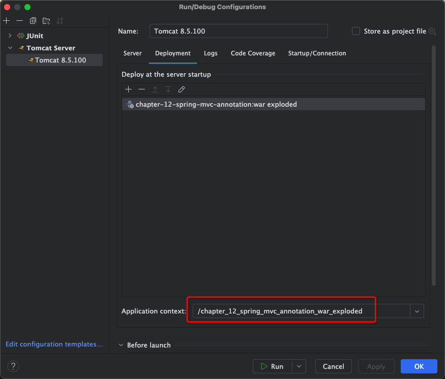

#### 说明

1. 下面红框中的两处的配置应该一致，否则服务启动后会报 404




2. 注意[springmvc-config.xml](src/main/resources/springmvc-config.xml)中的配置，这里/WEB-INF/jsp/，jsp 后面还有个'/'，不加这个'/'也会 404

```xml
    <bean id="viewResolver" class="org.springframework.web.servlet.view.InternalResourceViewResolver">
        <!-- 设置前缀 -->
        <property name="prefix" value="/WEB-INF/jsp/"/>
        <!-- 设置后缀 -->
        <property name="suffix" value=".jsp"/>
    </bean>
```
